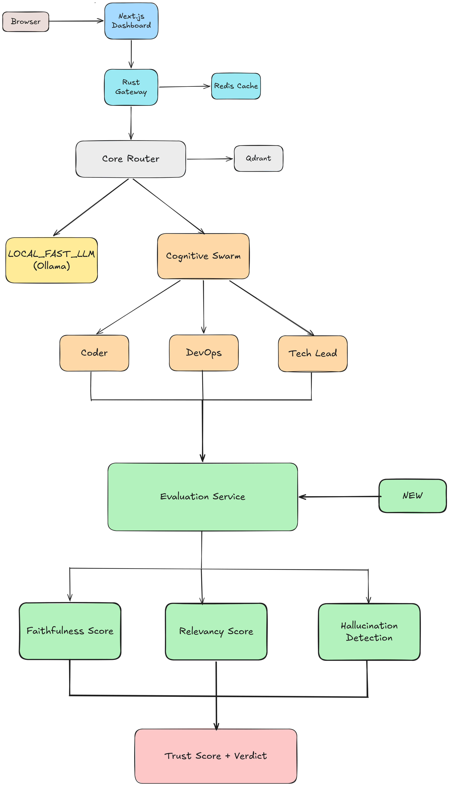

# Project Nexus

Reliable multi-agent AI intelligence platform. Routes requests
to specialized AI agents, evaluates every response for
hallucination risk and faithfulness, and surfaces trust scores
before the output reaches the user.

Most multi-agent systems tell you what the agent produced.
Nexus tells you whether to trust it.

---

## The problem

Current AI agent systems have four production failure modes
that all look like success:

1. **Silent hallucination** — the agent returns confidently wrong
   information. No error. No flag. The user sees a clean response.

2. **Misrouted complexity** — a complex technical question gets
   routed to a fast local LLM that lacks the reasoning depth to
   answer it correctly.

3. **No reasoning visibility** — when an agent produces a wrong
   answer, you cannot see which step in the chain failed.

4. **Trust without verification** — every agent output is treated
   as equally reliable regardless of the question complexity
   or the agent's demonstrated accuracy.

Nexus adds a reliability layer that addresses all four.

---

## Architecture



Five components communicating over gRPC:

| Component            | Stack                               | Responsibility                                             |
| -------------------- | ----------------------------------- | ---------------------------------------------------------- |
| `aetheros_gateway`   | Rust, Axum, Tonic                   | HTTP ingress, Redis L2 cache, request routing              |
| `core_router`        | Python, Qdrant, gRPC                | Semantic routing: matches query intent to agent capability |
| `cognitive_swarm`    | Python, LangGraph, gRPC             | Multi-agent execution: supervisor → specialist agents      |
| `evaluation_service` | Python, sentence-transformers, gRPC | Trust scoring, hallucination detection, faithfulness       |
| `nexus-dashboard`    | Next.js, React                      | Live cluster visibility, real execution metrics            |

---

## How the reliability layer works

Every response from the cognitive swarm passes through
the evaluation service before returning to the user.

```
            Agent response
                │
                ▼
┌─────────────────────────────────────┐

│         Evaluation Service          │

│                                     │

│  Faithfulness score                 │

│  → semantic alignment with context  │

│                                     │

│  Relevancy score                    │

│  → does answer address the question │

│                                     │

│  Hallucination risk detection       │

│  → overconfident assertions         │

│  → fabricated citations             │

│  → unsupported numeric claims       │

│                                     │

│  Trust score (weighted composite)   │

│  → TRUSTED / UNCERTAIN /            │

│    HALLUCINATION_RISK               │

└─────────────────────────────────────┘
                │
                ▼
Response + trust metadata returned to user

```

A response flagged as HALLUCINATION_RISK is still returned —
the system does not suppress agent output. But the trust score
and verdict travel with the response, allowing downstream
systems to decide how to handle low-trust outputs.

---

## Semantic routing

The core_router uses vector embeddings to match query intent
to agent capability — not keyword matching, not regex rules.

Six semantic anchors define the routing space:

| Intent          | Example anchor                                    |
| --------------- | ------------------------------------------------- |
| COGNITIVE_SWARM | "Deploy a kubernetes cluster with a rust backend" |
| COGNITIVE_SWARM | "Design a highly available database schema"       |
| LOCAL_FAST_LLM  | "What is the capital of France?"                  |
| LOCAL_FAST_LLM  | "Can you summarize this briefly?"                 |

A new query is embedded and compared by cosine similarity.
Queries above the 0.65 confidence threshold route to their
matched intent. Below threshold: fallback to LOCAL_FAST_LLM
with a warning log.

---

## The cognitive swarm

Three specialized agents behind a supervisor:

| Agent             | Specialization                                |
| ----------------- | --------------------------------------------- |
| `supervisor`      | Intent classification, agent selection        |
| `coder_agent`     | Software implementation, algorithms           |
| `devops_agent`    | Infrastructure, Docker, Kubernetes, Terraform |
| `tech_lead_agent` | Architecture explanation, technical guidance  |

The supervisor routes to the specialist agent. The specialist
produces the output. The evaluation service scores the output.

---

## Technical decisions

### Rust gateway over Python for ingress

The gateway is the single throughput bottleneck. Rust provides
zero-cost async with Tokio, no GC pauses during request routing,
and predictable latency. Python's asyncio has GIL contention under
concurrent gRPC calls — not acceptable for an ingress layer.

### Qdrant for semantic routing over rule-based routing

Rule-based routing (regex, keyword matching) fails when users
phrase requests in unexpected ways. Embedding-based routing
generalizes: any phrasing of "deploy infrastructure" routes
to COGNITIVE_SWARM without explicit rules for each variant.

### gRPC over REST for inter-service communication

Binary Protobuf serialization, HTTP/2 multiplexing, and
compile-time type contracts. Between services that are both
under our control, REST's flexibility is a liability —
gRPC's strictness is an asset.

### L2 Redis cache at gateway level

Identical prompts should never hit the agent pipeline twice.
The cache sits at the gateway (Rust) level — before any Python
process is involved. Cache hit latency is sub-millisecond.

### LangGraph over raw LLM calls for the swarm

LangGraph provides explicit state machines for agent flow.
The supervisor → specialist routing is a directed graph with
typed state. Raw LLM calls have no state management — agent
failures are invisible. LangGraph failures are visible and
traceable.

### Evaluation as a separate service (not embedded)

The evaluation service is independent from the swarm. This
means evaluation can be upgraded, scaled, and tested without
touching agent logic. It can also be called by external
systems that want to evaluate responses from other agent
frameworks.

---

## Kubernetes deployment

Full production deployment via Kubernetes.

```bash
# Deploy infrastructure
kubectl apply -f k8s/redis.yaml
kubectl apply -f k8s/qdrant.yaml

# Deploy services
kubectl apply -f k8s/gateway.yaml
kubectl apply -f k8s/router.yaml
kubectl apply -f k8s/swarm.yaml
kubectl apply -f k8s/dashboard.yaml

# Verify
kubectl get pods
kubectl get services
```

External access: dashboard at `localhost:30000`,
gateway at `localhost:30080`.

---

## Quick start (Docker Compose)

```bash
# 1. Set secrets (never hardcode these)
export OPENAI_API_KEY=sk-your-key

# 2. Start infrastructure
docker compose up -d

# 3. Start services
cd evaluation_service && python main.py &
cd core_router && python main.py &
cd cognitive_swarm && python main.py &
cd aetheros_gateway && cargo run

# 4. Open dashboard
open http://localhost:3000
```

---

## Roadmap

**V2 targets:**

- **RAGAS full integration** — ground truth dataset for calibrated scoring
- **Agent memory** — cross-session context for repeat users
- **Evaluation feedback loop** — low-trust responses trigger swarm retry
- **Distributed tracing** — OpenTelemetry across all five services
- **Confidence-gated responses** — suppress HALLUCINATION_RISK responses
  and re-route to a different agent automatically
